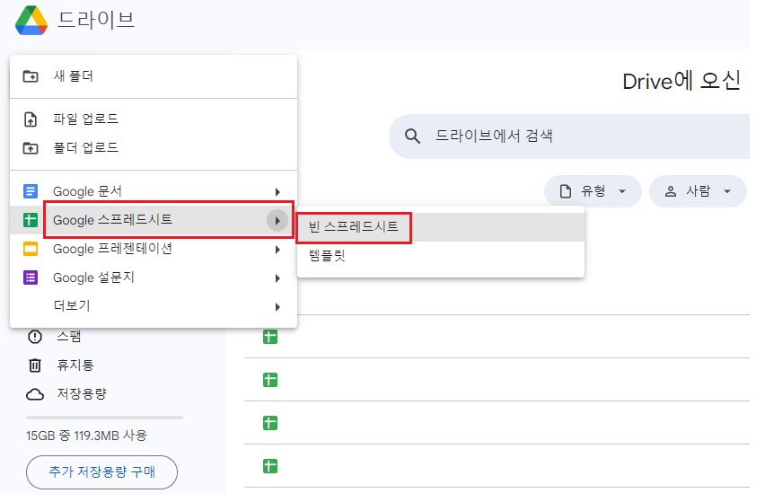
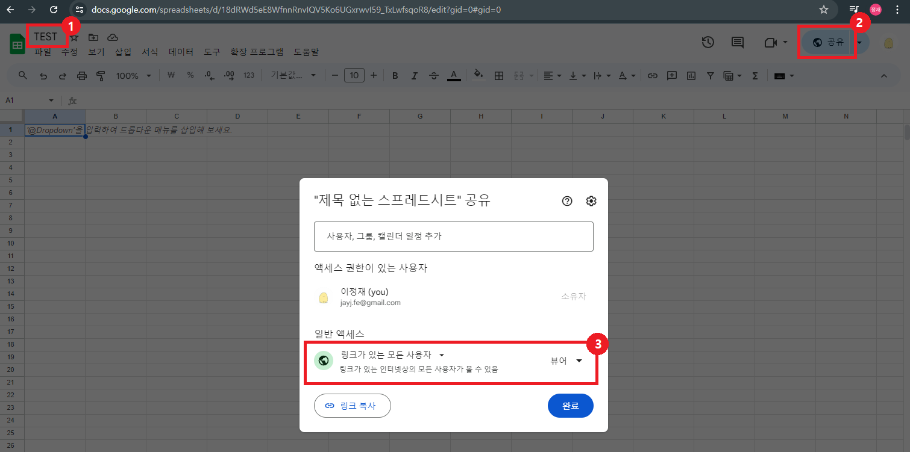
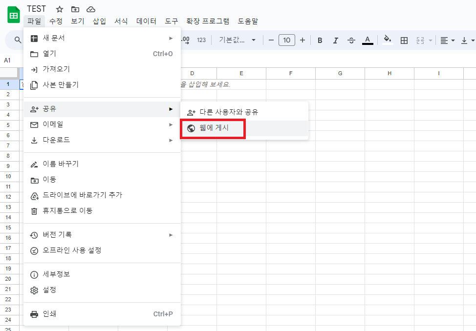
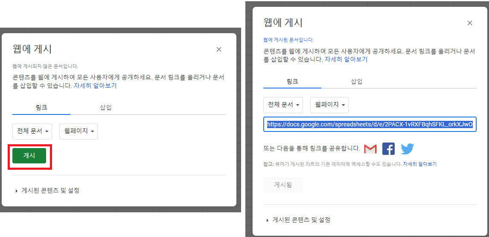
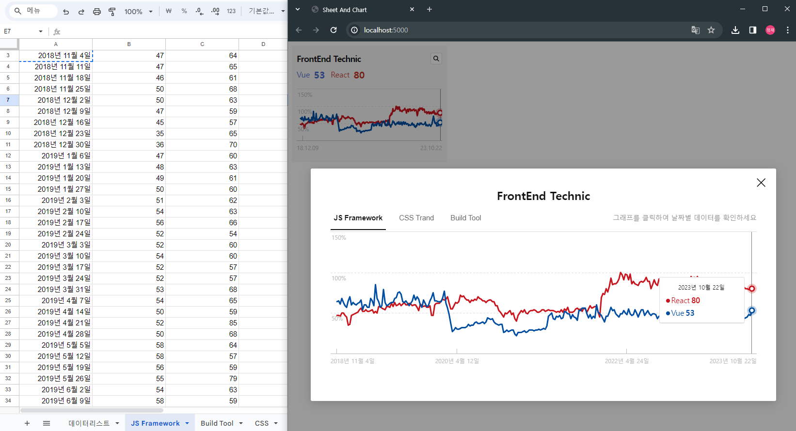

<br>

최근 회사 업무로 Google Sheets API를 사용하였다.<br>
이전까지 데이터를 관리, 연동 개발은 DateBase(DB)만 생각하었는데,<br>
DB구축을 하지 않고 간단하게 데이터를 저장하고 연동하여 활용할 수 있었다.<br>
<br>
개인적으로 간단하고 편하게 사용할 수 있었기에 정보를 공유하고 작성한다.

<br>

<hr>
<br>

## Google Sheets API
Google Sheets API를 사용하기 위해서는 Google Sheets를 생성해줘야한다.<br>

<br>

### Google Sheets 생성하기.

<br>

1. Google 메인 화면에서 상단의 메뉴 > 드라이브를 눌러준다.


<br>

2. 본인의 드라이브로 접속이 되었다면, 좌측 상단에 신규 > Google 스프레드시트 > 빈 스프레드시트를 선택한다.



<br>

3. Google 시트의 제목, 공유하기를 아래와 같은 순서대로 설정해준다.



<br>

4. 웹에 게시할 수 있도록 설정해준다.




### Google Sheets API 연결하기
웹에서 Google Sheets API 를 연동하기 위해서는 라이브러리를 설치해야한다.

<b>papaparse</b>이라는 라이브러리이다.<br>
해당 라이브러리를 설치한 후에는 아래와 같이 호출이 가능하다.

```js
const googleApiKey = "2PACX-1vTJkVv6S4u6xCfEv0bI-uq9qrJkMKClpNHlSsqBg9vnQbrmY9kF-fh0RsLP0EMDcxPowVrJYpxTFiF0";
const defaultURL = `https://docs.google.com/spreadsheets/d/e/${googleApiKey}/pub?output=csv&gid=`;

getGoogleSheetData(url){
  let callData;
  const data = new Promise((resolve) => {
    Papa.parse(defaultURL+url, {download: true, header: true, complete (results, file) { resolve( callData = results.data )}});
  });
  
  return data.then(()=>{
    return callData
  })
}
```

<br>
<hr>
<br>

### 활용했던 사이드 프로젝트
- <a href="https://github.com/jayj-fe/sheetAndChart/tree/main" target="_blank">https://github.com/jayj-fe/sheetAndChart/tree/main</a>



<br>
<br>

## 참고 했던 자료 및 블로그
- <a href="https://neep305.tistory.com/67" target="_blank">https://neep305.tistory.com/67</a>
