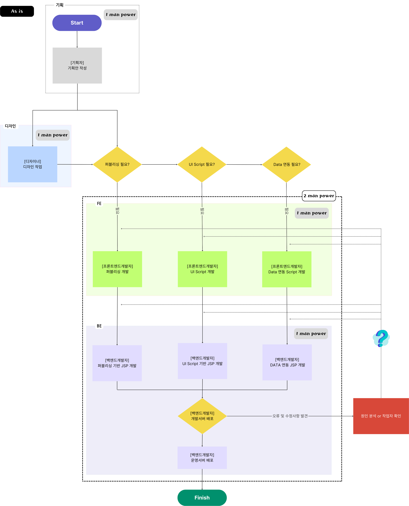
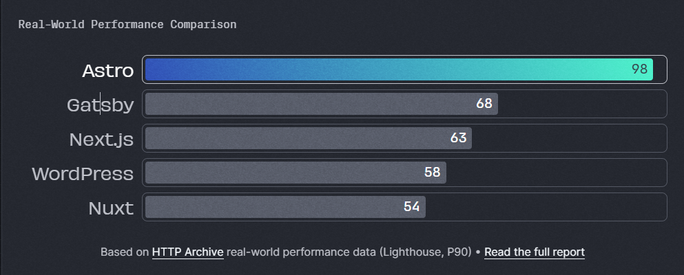
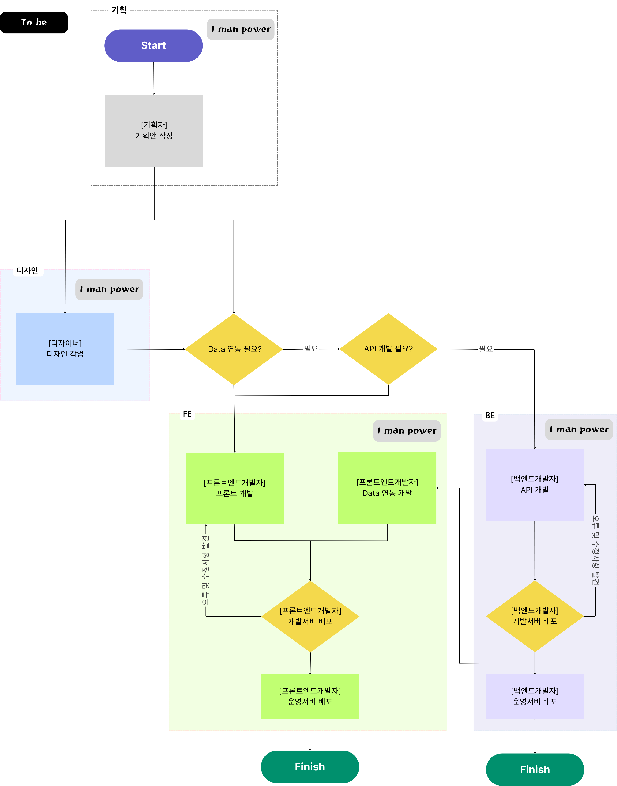

 

최근 회사에서 Astro.js를 도입하였다. 
Astro.js가 무엇인 지 앞서 왜 Astro.js를 도입하려고 했는 지 적으려고 한다.

 

 

## 도입 전 시스템
기존의 개발 도구(Grunt)는 빌드의 속도가 느려 Front End 개발 속도를 저하시키고, 또한 퍼블리싱(HTML, CSS)와 운영(JSP) 소스를 따로 관리하여 버전 관리의 어려움이 있었다. 
 
또한 퍼블리싱과 운영 담당자가 다름으로 오류 발생 시 원인 분석 시간이 늘어나고, 책임 소재가 불명확하며, 간단한 수정 사항(HTML, CSS)도 퍼블리싱(Front End), 운영(Back End) 담당자가 각각 투입되어 불필요한 인력 자원 사용하는 구조적인 문제점이 있었다. 

#### 관리 포인트 ( JSP )
- 잦은 배포로 피로도 늘어남.
  - QA 빈도 높음
  - 간단한 HTML 및 CSS 의 수정에도 백엔드개발자의 배포가 필요.
- 배포 후 오류 발생 시, 어디서 문제가 발생하였는 지 원인 분석 시간 소요 늘어남.
  - 회색지대 다수
- 화면(프론트)에 보이는 작업을 백엔드개발자가 진행하면서 오류 발생 시 누가 수정해야 되는 지 불명확함.
  - 퍼블리싱대로 안나왔는데요? 
  - 이건 퍼블리싱에서 작업 해줘야해요.
  - 이건 서버에서 작업해줘야해요.

#### 개발속도 ( Grunt )
- build의 속도 이슈
  - 로컬에서 개발을 진행할 때 저장을 하고 확인을 할 때마다 1분이 넘는 불필요한 Build 시간이 발생.

#### 구조적 문제
- Front 전문 인력이 없어 front쪽 오류대응이 늦어짐.
- 퍼블리싱 소스와 JSP 소스를 별도로 관리함에 따른 소스 관리의 어려움.
  - 안쓰는 페이지들 다수 발생
  - 개발 생산성 저하
- 실서비스 배포 횟수가 많이 늘어남.
  - 그로 인하여 디자인적 수정이 우선순위 하향.

#### 개발자의 전문성 저하
- Backend 개발자
  - 프론트단의 JSP(HTML) 수정.
- Frontend 개발자
  - UI적인 Javascript만 수정.
  - 퍼블리싱 영역만 수정.

 

## 개선 방향
이러한 점들을 개선하기 위하여 새로운 개발 도구 및 언어를 도입, 관리 포인트를 적절하게 분할하고자 하였으며, 점진적 개선을 위하여 봉황대기 프로젝트에서 시범적으로 도입해보기로 했다.

### Front End 의 개발 도구 및 언어 변경
- Gulp에서 Astro.js로 변경
  - 도입 하는 프로젝트에서는 Back End 개발이 필요하지 않아 Front End 의 개발 도구부터 변경.

### Astro.js를 선택한 이유이자 Astro란.
#### 콘텐츠 중심
- Astro는 대시보드나 SNS 등의 복잡한 웹 애플리케이션보다는 콘텐츠 중심의 정적 웹 사이트를 만드는 데에 뛰어남. 
(빠르고 html 렌더링 등과 같은 이유로)
#### 서버 우선주의
- 기본적으로 SSR 이며, PHP, JSP/JAVA, Ruby on Rails 와 같이 domain 에 접근하면 html 를 내려주는 형식. 
(서버에서 html 를 렌더링 할떄 가장 빠름)
#### 편리함
- Astro는 기술 수준이나 과거 웹 개발 경험에 관계없이 친숙하고 접근하기 쉽게 설계됨. 
#### 속도
- 
#### 확장성
- Astro IsIand 라는 특징을 가지고 있으며, Astro 내에서 React, Vue, Svelte 등 다양한 언어를 통합하여 사용할 수 있음.

 

## Astro.js 도입으로 변한 점
개발 도구 및 언어를 변경함에 따라 불필요한 빌드 대기 시간을 줄여 개발 속도를 향상 시킬 수 있었고, <b>Astro.js의 Island 특징을 살려 React, Vue 등 다양한 언어를 도입할 기반을 마련</b>할 수 있었다.

<table>
  <caption>Astro.js 도입으로 변한 점</caption>
  <thead>
    <tr>
      <th scope='col'></th>
      <th scope='col'>Gulp Project</th>
      <th scope='col'>Astro.js Project</th>
</th>
    </tr>
  </thead>
  <tbody>
    <tr>
      <td>빌드 속도</td>
      <td>
        <b>정적 자원 별로 Build</b> 
        - HTML - 0.9s 
        - CSS - 1s 
        - JS - 6s 
        - Image - 5s 
        … 
        - TOTAL - 14 s
      </td>
      <td>
        <b>Page별로 Build</b> 
        - index page - 0.1s 
        - schedule page - 0.08s 
        - awards page - 0.2s 
        … 
        - TOTAL - <b>8.19 s</b> 
      </td>
    </tr>
    <tr>
      <td>개발자의 전문성 향상</td>
      <td></td>
      <td>
        Astro Island 
          - React Component 
          - Vue Component 
          - Svelte Compontent 
          … 
          - And More…
      </td>
    </tr>
  </tbody>
</table>

 

## 앞으로의 방향성
사내에 레거시 코드가 많아서 차근차근 변경해나가고 있다. 
현 프로젝트에서는 Back End 의 개발이 필요하지 않아  Front End만 Astro.js를 도입하였으나, 
아래와 같은 업무별로 분리하여 관리포인트를 가지는 게 가장 이상적인 업무 시스템이다.

FE/BE 분리로 새로운 Flow chart

 
따라서 향후 Front End와 Back End의 업무를 분할 하여 책임 소재를 명확하게 하고, 특정 직군의 업무 몰림 현상을 줄여 업무 피로도를 낮추고 업무의 효율성을 높이는 작업을 통하여 각자의 직무에 집중할 수 있는 환경을 만들어 전문성 향상 시키려고 한다.

 

 

### Astro를 사용한 프로젝트
- <a href="https://interactive.hankookilbo.com/v/dementia/" target="_blank">https://interactive.hankookilbo.com/v/dementia/</a>
- <a href="https://interactive.hankookilbo.com/v/sewol/" target="_blank">https://interactive.hankookilbo.com/v/sewol/</a>
<!-- 
 
 

## 참고 했던 자료 및 블로그
- <a href="https://neep305.tistory.com/67" target="_blank">https://neep305.tistory.com/67</a> -->
