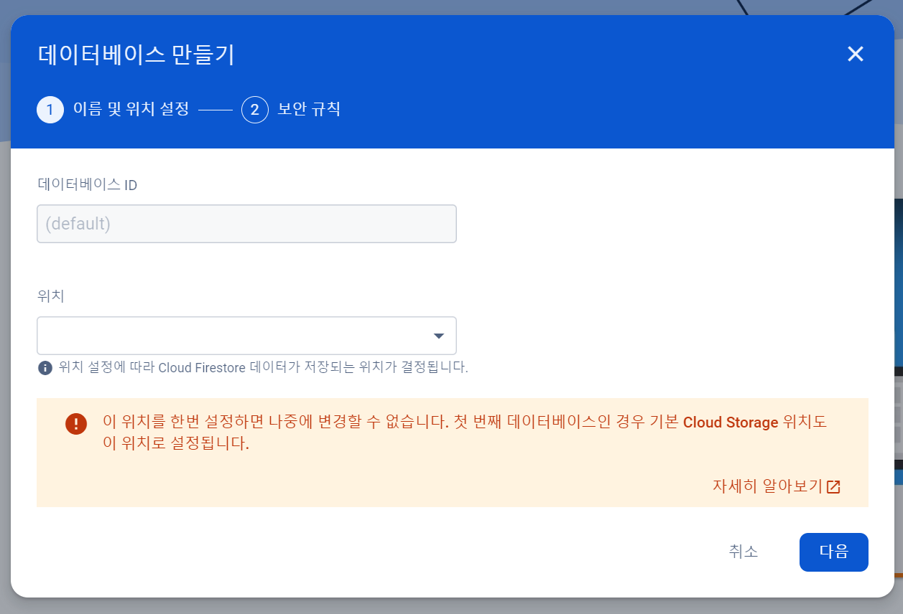

<br>

## FireBase - 데이터베이스 이용하기

<br>

### FireBase 란?
FireBase는 2014년도에 구글에서 인수한 모바일, 웹 애플리케이션 개발 플랫폼이다.
Firebase는 데이터베이스, 인증, 스토리지, 원격 구성, 푸시 알람 등다양한 기능을 제공한다.

<br>

### FireBase 시작하기
1. <a href="https://firebase.google.com/?hl=ko" target="_blank">공식사이트</a>에 일단 가입해야한다.
2. 공식사이트에서 로그인 후 console로 이동한다.<br>


3. 새 프로젝트를 추가한다.<br>


4. 프로젝트 이름을 설정한다.<br>


5. 계정을 선택한다.<br>


6. 생성이 완료되면 왼쪽 사이드 바에서 빌드 - Firestore Database를 선택한다.<br>


7. 데이터베이스를 생성한다.<br>


8. 안내에 따라 만든다. 위치는 빈 칸이어도 된다.<br>


9. 프로덕션 모드로 생성한다.<br>


10. 생성이 완료되면 컬렉션을 만든다.<br>


11. 문서 ID 필드를 설정해준다.<br>


12. 저장하면 생성된 것을 확인할 수 있다.<br>


<br>

### FireBase 사용하기

#### FireBase 연동
1. 데이터베이스가 생성이 됐다면 상단에 프로젝트 설정으로 들어간다.<br>


2. 내 앱에서 앱을 생성한다.<br>


3. 앱 닉네임을 작성하고 저장한다.<br>


4. 코드가 생성된 걸 확인하고 콘솔로 이동한다.<br>


5. 프로젝트에서 npm을 통해 firebase를 설치한다.<br>
```js
npm install firebase
```

6. fiebase-config.js를 만들어준다.
```js
src/
├─App.tsx
├─page
   └─page.tsx
├─lib/js
   └─firebase-config.js
```
```js
import { initializeApp } from "firebase/app";
import { getAuth } from 'firebase/auth';
import { initializeFirestore } from 'firebase/firestore';

const firebaseConfig = {
  apiKey: "",
  authDomain: "rma-timer.firebaseapp.com",
  projectId: "rma-timer",
  storageBucket: "rma-timer.appspot.com",
  messagingSenderId: "36890760256",
  appId: "1:36890760256:web:0a40a126cfd8ff3255fba5",
  measurementId: "G-T89GEDG664"
};

const app = initializeApp(firebaseConfig);
const auth = getAuth(app);
const db = initializeFirestore(app, {
  experimentalForceLongPolling: true,
});

export {auth, db};
```

#### FireBase 읽기
```js
import { db } from "../lib/js/firebase-config";
import { doc, collection, setDoc } from "firebase/firestore";

const firebaseUpdata = async () => {
  try {
    const saveData = {
      TestValue : ""
    }
    await setDoc(doc(db, "MyTestDB", "testSheet"), saveData);
  } catch (e) {
    console.error("Error adding document: ", e);
  }
};

```

#### FireBase 쓰기
```js
import { db } from "../lib/js/firebase-config";
import { doc, collection, getDocs } from "firebase/firestore";

  const firebaseInit = async () => {
    try {
      let completedData = []
      const docRef = await getDocs(collection(db, "MyTestDB"), "testSheet")
  
      docRef.forEach((element) => {
        completedData = element.data().TestValue
      });
  
      console.log(completedData);
    } catch (e) {
      console.error("Error adding document: ", e);
    }
  };
```
<br>
<hr>
<br>

## 참고 했던 자료 및 블로그
- <a href="https://harris91.vercel.app/what-is-firebase" target="_blank">https://harris91.vercel.app/what-is-firebase</a>
